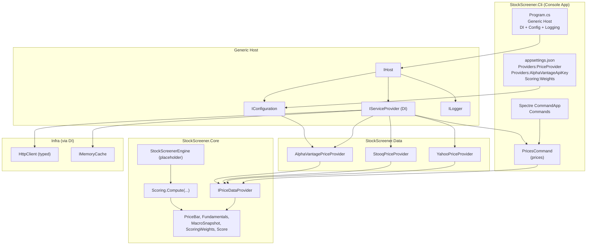

# StockScreener (svai) — Low Level Design (LLD)

## Current state (Jan 2026)

This repository is a .NET solution organized into three main layers:

- **`StockScreener.Cli`**: Console application (Spectre.Console.Cli) that hosts commands.
- **`StockScreener.Core`**: Domain layer (interfaces + scoring model + shared records).
- **`StockScreener.Data`**: Integration layer (market data providers).

### What works today

- The solution builds.
- A `prices` command is implemented and runnable.
- Price data providers exist for:
  - **Stooq** (default; no API key required)
  - Yahoo (unofficial endpoint)
  - Alpha Vantage (requires `Providers:AlphaVantageApiKey`)

### What is still missing

- A screening workflow/engine that orchestrates: fundamentals + price history + options + macro + scoring.
- Providers for `IFundamentalsProvider`, `IOptionsDataProvider`, and `IMacroDataProvider`.
- CLI commands like `screen`, `explain`, etc.

## CLI entrypoint + Hosting

`StockScreener.Cli/Program.cs` uses the **Generic Host** to set up:

- Configuration (`appsettings.json` + environment variables)
- Logging (console)
- Dependency Injection container (`IServiceProvider`)

Spectre.Console.Cli runs commands and uses a small adapter (`TypeRegistrar`) so commands can be constructed via Microsoft DI.

## Commands

### `prices`

Implemented in `StockScreener.Cli/Commands/PricesCommand.cs`.

Purpose:
- Fetch daily OHLCV bars for a ticker using `IPriceDataProvider`.
- Print results as a table.

Examples:
- `svai prices AAPL --days 30`
- `svai prices MSFT --start 2025-01-01 --end 2025-03-01`

## Provider selection

`IPriceDataProvider` is resolved at runtime based on:

- `Providers:PriceProvider` in `appsettings.json`

Supported values:
- `Stooq` (default/fallback)
- `Yahoo`
- `AlphaVantage` (or `alpha`, `alpha-vantage`)

## Architecture diagram

