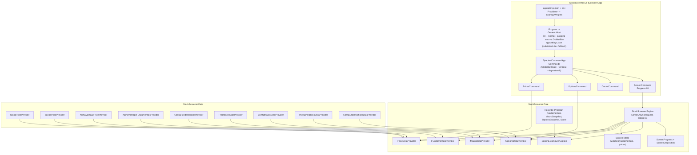

# StockScreener (svai) — Low Level Design (LLD)

## Current state (Jan 2026)

This repository is a .NET solution organized into three main layers:

- **`StockScreener.Cli`**: Console application (Spectre.Console.Cli) hosting commands.
- **`StockScreener.Core`**: Domain layer (interfaces + records + scoring + orchestration).
- **`StockScreener.Data`**: Integration layer (market data providers for prices/fundamentals/macro/options).

### What works today

- Builds and runs on .NET (`net10.0`).
- Commands implemented:
  - `prices` — fetch daily OHLCV bars
  - `options` — fetch a lightweight options snapshot (may return null)
  - `doctor` — show provider selection and config/secret diagnostics
  - `screen` — v0 screening workflow with filters and progress UI
- Screening orchestration lives in `StockScreener.Core.StockScreenerEngine`.
- Filters are supported (CLI flags) and applied in the engine before optional work.
- Unit tests exist for scoring consistency + filter behavior.

### Known gaps / limitations

- Scoring is intentionally a toy heuristic (not normalized / not sector-zscored).
- Options data can be unavailable on some Polygon plans (403 entitlement). The config fallback provider returns null.
- FRED macro snapshots can intermittently error per-series; macro is treated as optional and falls back to neutral values.

## CLI entrypoint + Hosting

`src/StockScreener.Cli/Program.cs` uses the **Generic Host** to set up:

- Configuration: `appsettings.json` + environment variables + `.env` (DotNetEnv)
- Logging (console)
- Dependency Injection container

Spectre.Console.Cli runs commands and uses a small adapter (`TypeRegistrar`) so commands can be constructed via Microsoft DI.

### Configuration loading (important for installed binaries)

The CLI sets the content root to the executable directory:

- `.UseContentRoot(AppContext.BaseDirectory)`

Then it loads configuration in this order:

1. `appsettings.json` next to the executable (published / installed scenarios)
2. Dev-time fallback: `../../../appsettings.json` relative to the executable directory (for `dotnet run`)
3. Environment variables

To make (1) work reliably, `src/StockScreener.Cli/StockScreener.Cli.csproj` copies `appsettings.json` to publish output:

- `<None Include="appsettings.json" CopyToOutputDirectory="PreserveNewest" CopyToPublishDirectory="PreserveNewest" />`

### Logging + diagnostics

- Console logging is enabled.
- Default log level is `Warning` to keep normal CLI output clean.
- Additional command output is exposed via global flags (see below).

## Global CLI flags

Defined in `src/StockScreener.Cli/Commands/GlobalSettings.cs` and inherited by commands:

- `--verbose` — show additional diagnostic output (does not change normal output)
- `--log-network` — enable HTTP request/response logging (debugging; can be noisy)

## Core model

Defined in `src/StockScreener.Core/Abstractions.cs`:

- Provider interfaces:
  - `IPriceDataProvider`
  - `IFundamentalsProvider`
  - `IMacroDataProvider`
  - `IOptionsDataProvider`
- Records:
  - `PriceBar`
  - `Fundamentals`
  - `MacroSnapshot`
  - `OptionsSnapshot`
  - `ScoringWeights`
  - `Score`

## Scoring

Implemented in `src/StockScreener.Core/Scoring.cs`:

- `Scoring.Compute(...)` — returns a weighted `Score`
- `Scoring.Explain(...)` — mirrors compute logic and returns a breakdown (raw components + weighted score)

Macro impact is a small heuristic (`MacroSectorTilt`) based on sector + macro snapshot.

## Screening orchestration

Implemented in `src/StockScreener.Core/StockScreenerEngine.cs`.

### Inputs

- `ScreenRequest`
  - `Tickers`, `Start`, `End`, `Weights`
  - `Filters` (optional)

### Outputs

- `ScreenResult`
  - `Ticker`, `Fundamentals`, `Prices`, `Score`
  - `Macro` and `Options` actually used during scoring (for explain-mode fidelity)

### Behavior (v0)

- Snapshot macro once per run.
  - If macro fails: use neutral-ish defaults (keeps macro contribution ~0).
- Per ticker:
  - Fetch fundamentals + prices.
  - Apply `ScreenFilters` (if provided) before doing any optional/expensive work (options).
  - Best-effort fetch options snapshot (null is acceptable).
  - Compute score.

### Progress reporting

`StockScreenerEngine.ScreenAsync(...)` accepts an optional `IProgress<ScreenProgress>`.

- `ScreenProgress` includes:
  - `Ticker`, `Completed`, `Total`, and `ScreenDisposition`
- `ScreenDisposition` includes:
  - `Included`, `SkippedBlank`, `SkippedNoFundamentals`, `SkippedNoPrices`, `SkippedFilteredOut`, `Failed`

### Parallelism

Screening is parallelized with bounded concurrency (`SemaphoreSlim`) to improve throughput while respecting likely provider rate limits.

- `maxConcurrency = min(Environment.ProcessorCount, 8)`

## Filters

Defined in `StockScreener.Core` as `ScreenFilters`:

- `MinFcfYield`
- `MaxPe`
- `MinRoic`
- `MaxNetDebtToEbitda`
- `MinMomentum` (20d momentum)

Filters are applied in `StockScreenerEngine` before options fetch and scoring.

## Commands

### `prices`

`src/StockScreener.Cli/Commands/PricesCommand.cs`

- Uses `IPriceDataProvider`
- Prints an OHLCV table

### `options`

`src/StockScreener.Cli/Commands/OptionsCommand.cs`

- Uses `IOptionsDataProvider`
- Prints snapshot (if present) or a “no data” message

### `doctor`

`src/StockScreener.Cli/Commands/DoctorCommand.cs`

- Prints:
  - configured providers (from config)
  - effective provider types (from DI)
  - API key presence (masked)
  - (verbose) config key presence + source tracing (json/env)

### `screen`

`src/StockScreener.Cli/Commands/ScreenCommand.cs`

- Uses `StockScreenerEngine`
- Shows a progress bar while screening tickers
  - Tracks included vs skipped counts using `ScreenDisposition`
- Uses scoring weights from config keys:
  - `Scoring:Weights:Value`
  - `Scoring:Weights:Quality`
  - `Scoring:Weights:Momentum`
  - `Scoring:Weights:Options`
  - `Scoring:Weights:Macro`
- Supports `--explain <TICKER>` to print a breakdown for a ticker from the result set

## Provider selection

Provider selection happens in `src/StockScreener.Cli/Program.cs` using config keys:

- `Providers:PriceProvider`
- `Providers:FundamentalsProvider`
- `Providers:MacroProvider`
- `Providers:OptionsProvider`

Selection rules:

1. If an explicit provider is configured, it is used.
2. Otherwise, some providers prefer a "real" implementation when the corresponding API key is present.
3. Final fallback is a safe, local/config provider.

## Data providers (high-level)

- Prices:
  - `StooqPriceProvider` (CSV; no key)
  - `YahooPriceProvider` (unofficial)
  - `AlphaVantagePriceProvider`
- Fundamentals:
  - `AlphaVantageFundamentalsProvider`
  - `ConfigFundamentalsProvider`
- Macro:
  - `FredMacroDataProvider`
  - `ConfigMacroDataProvider`
- Options:
  - `PolygonOptionsDataProvider` (may be entitlement-gated)
  - `ConfigStockOptionsDataProvider` (returns null)

## Tests

`tests/StockScreener.Tests` (xUnit + FluentAssertions)

- `ScoringTests` covers:
  - `ScreenFilters.Matches(...)` behavior
  - `Scoring.Explain(...)` vs `Scoring.Compute(...)` consistency
  - basic macro sector tilt expectations

## Architecture diagram

