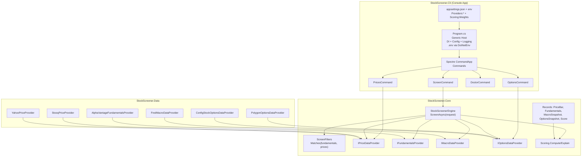

# StockScreener (svai) — Low Level Design (LLD)

## Current state (Jan 2026)

This repository is a .NET solution organized into three main layers:

- **`StockScreener.Cli`**: Console application (Spectre.Console.Cli) hosting commands.
- **`StockScreener.Core`**: Domain layer (interfaces + records + scoring + orchestration).
- **`StockScreener.Data`**: Integration layer (market data providers for prices/fundamentals/macro/options).

### What works today

- The solution builds and runs.
- Commands implemented:
  - `prices` — fetch OHLCV bars
  - `options` — fetch a lightweight options snapshot (may return null)
  - `doctor` — show provider selection and config/secret diagnostics
  - `screen` — v0 screening workflow + `--explain` breakdown
- Screening orchestration lives in `StockScreener.Core.StockScreenerEngine`.
- Simple CLI filters are supported and applied in the engine.
- Unit tests exist for filters and scoring consistency.

### Known gaps / limitations

- Scoring is a toy heuristic (not normalized / not sector-zscored).
- Options provider may be unavailable on certain Polygon plans (403 entitlement); config fallback returns null.
- FRED macro snapshots can intermittently error per-series; the engine treats macro as optional and falls back to neutral values.

## CLI entrypoint + Hosting

`src/StockScreener.Cli/Program.cs` uses the **Generic Host** to set up:

- Configuration: CLI-local `appsettings.json` + environment variables + `.env` (DotNetEnv)
- Logging (console)
- Dependency Injection container

Spectre.Console.Cli runs commands and uses a small adapter (`TypeRegistrar`) so commands can be constructed via Microsoft DI.

> Important: the CLI sets a deterministic content root so `appsettings.json` loads correctly even when running from other working directories.

## Core model

Defined in `src/StockScreener.Core/Abstractions.cs`:

- Provider interfaces:
  - `IPriceDataProvider`
  - `IFundamentalsProvider`
  - `IMacroDataProvider`
  - `IOptionsDataProvider`
- Records:
  - `PriceBar`
  - `Fundamentals`
  - `MacroSnapshot`
  - `OptionsSnapshot`
  - `ScoringWeights`
  - `Score`

## Scoring

Implemented in `src/StockScreener.Core/Scoring.cs`:

- `Scoring.Compute(...)` — returns a weighted `Score`
- `Scoring.Explain(...)` — mirrors compute logic but returns a `ScoreBreakdown` (raw components + weighted score)

Macro impact is currently a toy heuristic (`MacroSectorTilt`) using the sector and macro snapshot values.

## Screening orchestration

Implemented in `src/StockScreener.Core/StockScreenerEngine.cs`.

Inputs:

- `ScreenRequest`
  - `Tickers`, `Start`, `End`, `Weights`
  - `Filters` (optional)

Outputs:

- `ScreenResult`
  - `Ticker`, `Fundamentals`, `Prices`, `Score`
  - `Macro` and `Options` actually used during scoring (for explain-mode fidelity)

Behavior (v0):

- Snapshot macro once per run.
  - If macro fails: use neutral defaults (keeps macro contribution ~0).
- For each ticker:
  - Fetch fundamentals + prices.
  - Apply optional `ScreenFilters`.
  - Best-effort fetch options snapshot.
  - Compute score.

## Filters

Defined in `StockScreener.Core` as `ScreenFilters`:

- `MinFcfYield`
- `MaxPe`
- `MinRoic`
- `MaxNetDebtToEbitda`
- `MinMomentum` (20d momentum)

Filters are applied in `StockScreenerEngine` before options/scoring.

## Commands

### `prices`

`src/StockScreener.Cli/Commands/PricesCommand.cs`

- Uses `IPriceDataProvider`
- Prints OHLCV table

### `options`

`src/StockScreener.Cli/Commands/OptionsCommand.cs`

- Uses `IOptionsDataProvider`
- Prints snapshot or a no data message (provider returned null)

### `doctor`

`src/StockScreener.Cli/Commands/DoctorCommand.cs`

- Prints:
  - configured providers (from config)
  - effective provider types (from DI)
  - API key presence (masked)
  - (verbose) config source tracing (json/env)

### `screen`

`src/StockScreener.Cli/Commands/ScreenCommand.cs`

- Uses `StockScreenerEngine`
- Renders ranked results table
- `--explain <TICKER>` renders:
  - fundamentals table
  - factor raw + weighted breakdown
  - options presence

## Provider selection

Provider selection happens in `src/StockScreener.Cli/Program.cs` using config keys:

- `Providers:PriceProvider`
- `Providers:FundamentalsProvider`
- `Providers:MacroProvider`
- `Providers:OptionsProvider`

Fallback behavior favors:

- config-specified provider if possible
- otherwise a safe default (e.g., Stooq for prices, config fallback for options)

## Data providers (high-level)

- Prices:
  - `StooqPriceProvider` (CSV; no key)
  - `YahooPriceProvider` (unofficial)
- Fundamentals:
  - `AlphaVantageFundamentalsProvider`
- Macro:
  - `FredMacroDataProvider`
- Options:
  - `PolygonOptionsDataProvider` (may be entitlement-gated)
  - `ConfigStockOptionsDataProvider` (returns null)

## Tests

`tests/StockScreener.Tests` (xUnit + FluentAssertions)

- `ScoringTests` covers:
  - `ScreenFilters.Matches(...)` behavior
  - `Scoring.Explain(...)` vs `Scoring.Compute(...)` consistency
  - basic macro sector tilt expectations

## Architecture diagram

